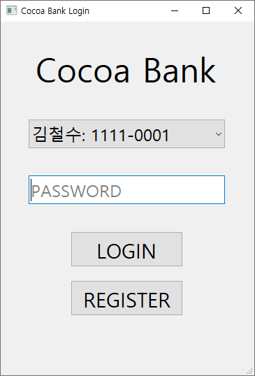
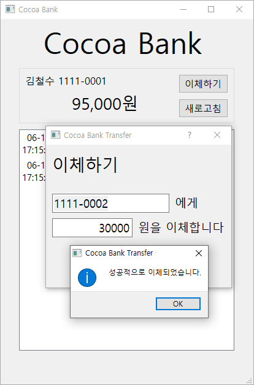
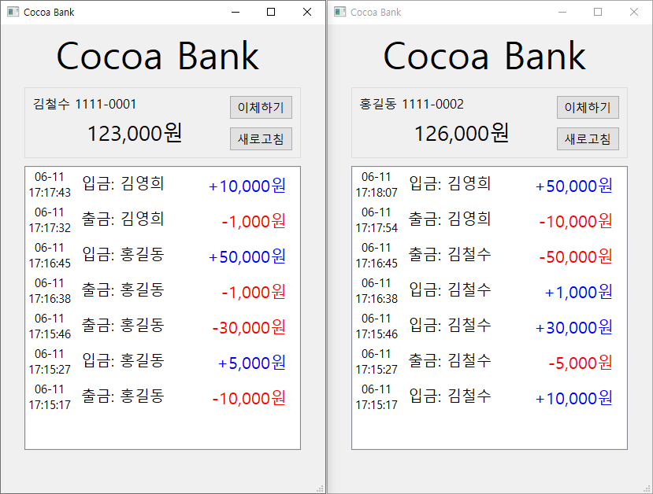

# Cocoa-Bank

## Summary
파이썬으로 구현한 간단한 송금 서비스 애플리케이션 입니다.
대칭키/비대칭키 암호화 및 해시 알고리즘을 이용하여 [전자봉투][DE](digital envelope)를 구현하는 것을 목표로 개발하였습니다.
전자봉투 구현에는 RSA와 AES, SHA-256 알고리즘을 사용하였으며, 비밀번호 저장에는 bcrypt 알고리즘을 적용하였습니다.
서버-클라이언트 구조이며 서버는 flask 프레임워크를 사용하고 통신 프로토콜로 DEoH(Digital-Envelope over HTTP)을 개발하였습니다.

[DE]: http://wiki.hash.kr/index.php/전자봉투

This is a simple banking service application implemented in Python.
It was developed with the goal of realizing a digital envelope using a symmetric/asymmetric encryption and hash algorithm.
The RSA, AES, and SHA-256 algorithms were used to implement it, and the bcrypt algorithm was applied to store the password.
It is a server-client structure, and the server uses flask framework and DEoH(Digital-Envelope over HTTP) protocol that we made.

## Digital Envelope
전자봉투를 이용하여 암호화할 경우 수신자만 복호화가 가능합니다.
전자봉투는 대칭키 암호화를 이용해 기밀성을 보장하고, 해시를 통해 무결성을 보장하며,
비대칭키 암호화를 이용한 전자서명을 통해 부인 방지를 지원합니다.

전자봉투 암호화 과정:
1. 전달하고자 하는 평문 데이터(plain-data)의 해시 값을 계산합니다.
2. 해시 값을 송신자의 개인키로 암호화(encrypted-hash)하여 전자서명합니다.
3. 대칭키 암호화에 사용할 비밀키(secret-key)를 생성합니다.
4. 평문 데이터, 2번에서 암호화된 해시, 송신자의 인증서를 3번의 비밀키로 암호화합니다.
5. 비밀키를 수신자의 공개키로 암호화합니다.
6. 4번 결과와 5번 결과를 수신자에게 전송합니다.

전자봉투 복호화 과정:
1. 수신자의 개인키로 비밀키를 복호화합니다.
2. 비밀키로 복호화하여 평문 데이터, 암호화된 해시, 송신자의 인증서를 획득합니다.
3. 평문 데이터의 해시 값을 계산합니다.
4. 암호화된 해시 값을 송신자의 공개키로 복호화하여 계산한 해시와 비교합니다.
5. 두 해시가 일치할 경우 해당 데이터를 사용하고, 그렇지 않으면 폐기합니다.


## Screenshots




## Environment & Run
1. Python 3.8 이상 설치
1. 필요한 패키지 설치
   - `pip install -r requirements.txt`
1. 서버 실행 (포트: 5000)
   - `python src/server.py`
   - **중요:** 서버 종료시 Ctrl+C 키를 사용할 것 (콘솔 창의 X버튼 누르면 데이터가 저장되지 않음)
1. 클라이언트에 서버 공개키 등록
   - `src/client.py` 코드 열기
   - `server-public.pem` 파일 내용으로 `SERVER_PUBLIC_KEY` 변수 수정
1. 클라이언트 실행
   - `python src/client_ui.py`

## Error Messages
- RSA key format is not supported
  - 클라이언트에 서버 공개키 등록 안됨
- Incorrect decryption.
  - 패킷이 변조되었거나, 서버 공개키가 변경됨

## TODO
- 변경내역 발생시 자동 새로고침
- 사용자 데이터베이스 MariaDB로 변경
- ATM 입금/출금 구현
- UI 디자인 개선
- CA를 통한 인증서 확인

## Build for production
```sh
pip install pyinstaller
easy_install pyinstaller
pyinstaller --onefile src/server.py
pyinstaller --onefile --add-data "ui;ui" src/client_ui.py
```

<!-- pyi-makespec --onefile src/client_ui.py # --noconsole -->
<!-- pyinstaller client_ui.spec -->
<!-- https://stackoverflow.com/questions/41870727/pyinstaller-adding-data-files -->

<!-- openssl rsa -in server-private.pem -text -inform PEM -noout -->

## License
MIT License
